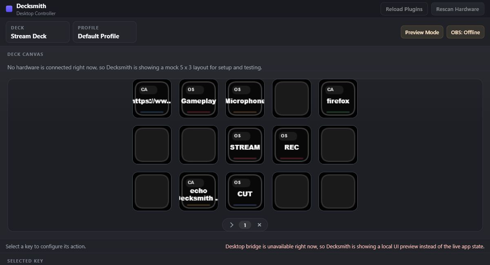
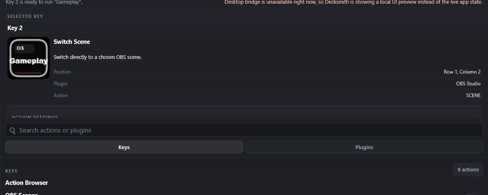

# Decksmith Alpha Foundation

Decksmith is a Linux-first, open-source alternative to the Elgato Stream Deck app.

This alpha is focused on two things first:

- a polished desktop UI that feels like a real app, not a rough utility
- a plugin API simple enough that independent developers can build actions quickly

The current build already includes live OBS Studio control, a drag-and-drop deck editor, built-in core actions, and GitHub-importable plugins.

## Screenshots

### Main Workspace



### Key Inspector



## Start Here

If you want to try the app locally, this is the fastest path.

### 1. Install dependencies

```bash
npm install
```

### 2. Launch the desktop app

```bash
npm start
```

If Electron-native HID dependencies ever need a manual refresh on your machine, run:

```bash
npm run install:app-deps
```

### 3. Boot with or without hardware

If no Stream Deck is connected, Decksmith starts with a mock 15-key deck so you can still test the UI and plugin flow.

If a real Stream Deck is connected, Decksmith detects it, adapts the deck grid to the connected model, and lets physical button presses trigger assigned actions.

### 4. Connect OBS Studio

Open OBS Studio and make sure the built-in WebSocket server is enabled.

Then in Decksmith:

1. Open the OBS connection panel.
2. Enter the host, port, and password from OBS.
3. Connect and let the app load scenes and inputs.

OBS Studio includes obs-websocket by default in OBS `28.0.0` and later.

### 5. Assign your first action

The current alpha already supports a live-useful first setup:

1. Select a key in the deck UI.
2. Open the action browser.
3. Choose an action such as `OBS Studio -> Switch Scene`.
4. Configure that action in the inspector under the deck UI.
5. Trigger it either from the app preview or from the physical Stream Deck.

### 6. Test Linux packages

For Fedora and other RPM-friendly distros:

```bash
npm run dist:linux:fedora
```

This produces:

- a Linux `.rpm`
- a Linux `.AppImage`

Detailed distro notes live in `docs/fedora-alpha.md` and `docs/linux-compatibility.md`.

### 7. Test the Windows portable build

```bash
npm run dist:win
```

This produces a portable Windows `.exe` in `dist/`.

## GitHub Releases

Version tags such as `v0.1.0-alpha` trigger `.github/workflows/alpha-release.yml`.

That workflow currently publishes:

- a Linux `.rpm` for Fedora and other RPM-based desktops
- a Linux `.AppImage` for portable testing across distros
- a Windows portable `.exe` for testers who want the app outside Linux

## Plugin Tutorial

In development, plugins live in `/plugins`.

In packaged builds:

- bundled plugins ship inside the app
- user plugins are loaded from the app data plugin folder
- plugins can be imported from GitHub links directly in the Plugins tab
- future marketplace feeds can point to plugin sources without changing the core import UI

Every plugin needs:

- `manifest.json`
- `index.js`

Minimal manifest:

```json
{
  "id": "com.example.my-plugin",
  "name": "My Plugin",
  "version": "0.1.0",
  "actions": [
    {
      "id": "my-action",
      "name": "My Action",
      "defaultLabel": "GO",
      "accentColor": "#3dd9c1"
    }
  ]
}
```

Minimal entry script:

```js
module.exports.activate = async ({ registerAction }) => {
  registerAction({
    id: 'my-action',
    onTrigger: async ({ slot, deck, assignment, services }) => {
      console.log(`Triggered ${slot.slotId} on ${deck.productName}`);
    }
  });
};
```

Example plugins already in the repo:

- `plugins/io.decksmith.demo.hello/`
- `plugins/io.decksmith.core/`
- `plugins/io.decksmith.obs/`

## Linux Hardware Access

Decksmith targets `@elgato-stream-deck/node`, which handles HID transport and key rendering for Stream Deck devices.

On Linux, hardware access still depends on correct `udev` permissions. The repo includes cross-distro guidance and example rules in:

- `linux/udev/60-decksmith-user.rules`
- `linux/udev/60-decksmith-headless.rules.example`
- `docs/linux-compatibility.md`
- `docs/fedora-alpha.md`

## Project Layout

- `electron/`
  - Electron entrypoint and preload bridge.
- `src/main/`
  - Device discovery and rendering service backed by `@elgato-stream-deck/node`.
  - Plugin loader that scans `/plugins` for folders containing `manifest.json` and `index.js`.
  - Persistent layout state and OBS connection settings stored in the app data directory.
  - OBS WebSocket service for scene discovery and scene switching.
- `src/renderer/`
  - Desktop UI with an OBS connection panel, plugin palette, drag-and-drop deck grid, and key inspector.
  - Canvas-based previews that can be sent directly to hardware as raw RGBA buffers.
- `build/`
  - Electron Builder icon assets and Linux RPM post-install scripts.
- `docs/architecture.md`
  - Structural overview and next-step recommendations.
- `CONTRIBUTING.md`
  - Contributor workflow, setup, and PR expectations.

## Why Electron First

Electron is the best fit for the current milestone because the main process can talk directly to Node-based HID libraries while the renderer stays free to build a polished desktop UI in plain web technologies.

This keeps the whole app in JavaScript for now while still leaving room to revisit Tauri later if footprint matters more than implementation speed.

## Features

### Built-in Alpha Actions

- `Core Actions`
  - open a URL or custom protocol
  - launch an app or executable path
  - run a shell command with a timeout
- `OBS Studio`
  - switch scenes
  - mute or unmute inputs
  - start or stop streaming
  - start or stop recording
  - toggle source visibility
  - control studio mode transitions

### Included in the current alpha

- hardware-aware Stream Deck grid that adapts to the connected device
- mock deck mode when no hardware is attached
- drag-and-drop key assignment flow
- key inspector below the main deck UI
- built-in OBS connection and scene discovery
- GitHub plugin import flow
- Fedora-friendly Linux packaging path
- Windows portable build path

## License

Decksmith is licensed under `GPL-3.0-or-later`.

That means forks and redistributed modified versions must stay under the same GPL family terms, keep notices intact, and make their source available under the same license when they distribute the app.

Open source licenses still allow commercial redistribution, so the thing that stops someone from passing a fork off as the official project is the branding policy in `TRADEMARKS.md`, not the GPL by itself.

## Contributing

If you want to help build Decksmith, start with `CONTRIBUTING.md`.
